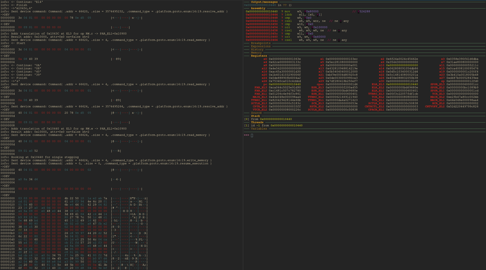

# Baremetal Embeddable Debugger

[FlorenceOS discord server](https://discord.gg/uaXtZVku2E)



A very small and simple debugger. It takes only a single RWX page and you can run it from anywhere where you have code execution and a way to send and recieve data (UART, USB, Network, whatever).

### Running `client_<arch>` on the host machine
* Redirect any data transmitted from the device into `stdin` of this process.
* Redirect anything written on this process `stdout` to the device. The process will first send a little-endian `u32` of the size to transmit. Then as many bytes follow. It is important to send data in these kinds of packets for packet based transport protocols like TCP or USB.
* A gdbserver will now be hosted (default port `1337`)

An example of how to run the client while using `/dev/ttyUSB0` as the communications channel is available [here](./examples/uart.py). This is also what's used in the screenshot above.

### Debugger (`host_<arch>[_opts].bin`) setup (device end):
```c
typedef void (*send_fn)(uint8_t const *, size_t);
typedef void (*recv_fn)(uint8_t *, size_t);

// Cast the binary address to this function signature and call it with
// your callback functions
extern bootstrap_debugger(send_fn, recv_fn) void;
```

Your device will trap into the debugger before returning.
